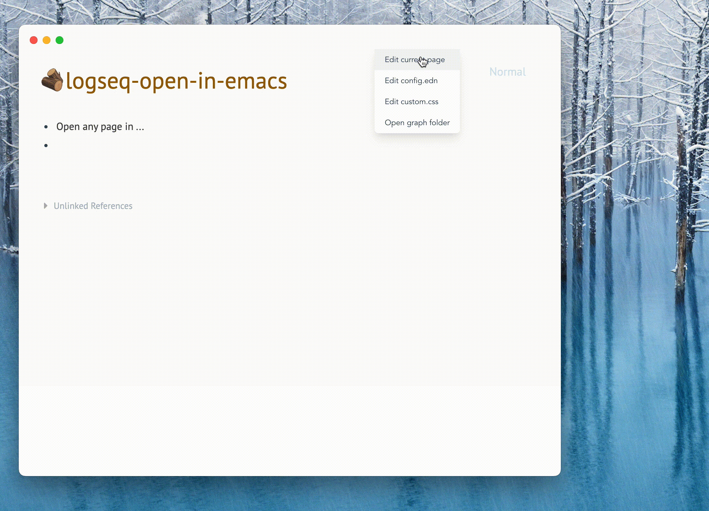

# Open Logseq in Emacs

Open and edit Logseq pages and config files in Emacs.



## NEWS

* v0.0.3
  - Update to be compatible with Logseq v0.9.1.  **IMPORTANT**: If you are using older versions (prior to v0.9.1) and experience experience issues, please downgrade to 0.0.2 manually.
* v0.0.2
  - Command Palette support. Try `mod+shift+p`.
  - Add a keyboard shortcut to edit the current page (default `mod+o`).

## Configuration

First, [set up Org-protocol](https://orgmode.org/worg/org-contrib/org-protocol.html).  This is due to the limitations of Logseq and, in general, Electron.

Second, add the following to your config file:

```lisp
(use-package org-protocol
  :ensure org
  :config
  (add-to-list 'org-protocol-protocol-alist
               '("org-find-file" :protocol "find-file" :function org-protocol-find-file :kill-client nil))

  (defun org-protocol-find-file-fix-wsl-path (path)
    "If inside WSL, change Windows-style paths to WSL-style paths."
    (if (not (string-match-p "-[Mm]icrosoft" operating-system-release))
        path
      (save-match-data
        (if (/= 0 (string-match "^\\([a-zA-Z]\\):\\(/.*\\)" path))
            path
          (let ((volume (match-string-no-properties 1 path))
                (abspath (match-string-no-properties 2 path)))
            (format "/mnt/%s%s" (downcase volume) abspath))))))

  (defun org-protocol-find-file (fname)
    "Process org-protocol://find-file?path= style URL."
    (let ((f (plist-get (org-protocol-parse-parameters fname nil '(:path)) :path)))
      (find-file (org-protocol-find-file-fix-wsl-path f))
      (raise-frame)
      (select-frame-set-input-focus (selected-frame)))))
```

To verify your config, run the following command,

```shell
emacsclient -c 'org-protocol://find-file?path=/tmp/some_file.txt'
```

it should open a new frame that visits `/tmp/some_file.txt`.

(Yes, you could have shortcut the protocol thing, but org-protocol is popular and widely supported, so why not? :-)

## Development

- `npm install && npm run build` in terminal to install dependencies.
- `Load unpacked plugin` in Logseq Desktop client.

## Credits

This plugin is a fork of [open-in-code](https://github.com/rebornix/logseq-open-in-code).
